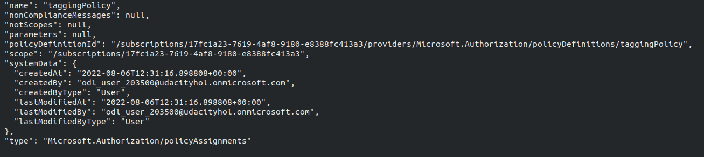
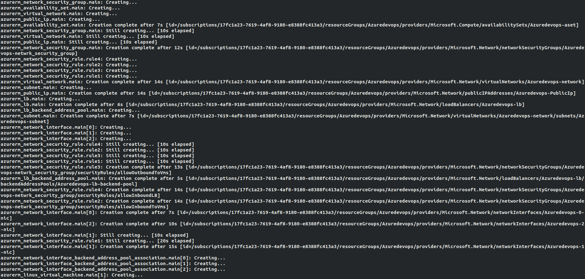
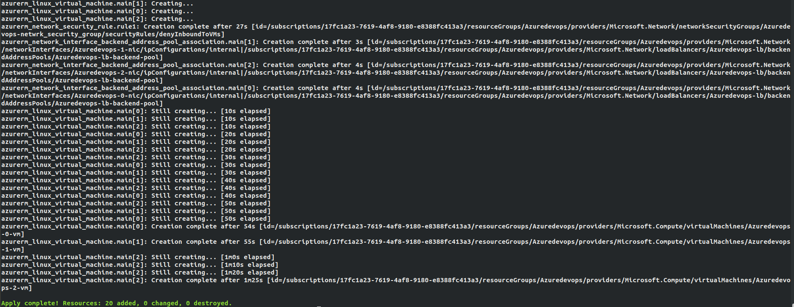
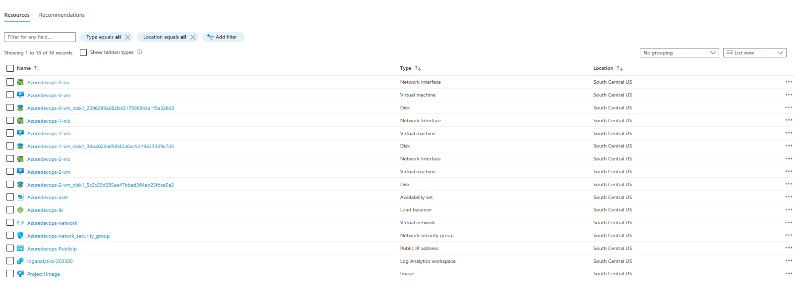

# Azure Infrastructure Operations Project: Deploying a scalable IaaS web server in Azure

### Introduction
For this project, you will write a Packer template and a Terraform template to deploy a customizable, scalable web server in Azure.

### Getting Started
1. Clone this repository

2. Install all the dependencies mentioned below in Dependencies section

3. Export the following variables in the terminal using export.

   * ARM_CLIENT_ID (Application ID)
   * ARM_CLIENT_SECRET (Secret key)
   * ARM_SUBSCRIPTION_ID (Subscription ID)
   * ARM_TENANT_ID (Tenent ID)


### Dependencies
1. Create an [Azure Account](https://portal.azure.com) 
2. Install the [Azure command line interface](https://docs.microsoft.com/en-us/cli/azure/install-azure-cli?view=azure-cli-latest)
3. Install [Packer](https://www.packer.io/downloads)
4. Install [Terraform](https://www.terraform.io/downloads.html)

### Instructions
1. Login in Azure CLI

``` bash
az login
```

2. Create Policy definition with tagging policy
``` bash
az policy definition create --name taggingPolicy --rules tagging-policy.json
```

3. Assign the tagging policy created to particular subscription
``` bash
az policy assignment create --name taggingPolicy --policy taggingPolicy --scope /subscriptions/xxxxxx
```

4. Create server image using packer template
``` bash
packer build server.json
```
5. Initialize terraform and create the template for the infrastructure and save it in solution.plan
``` bash
terraform init
terraform plan -out solution.plan
```
6. Create the resources for the infrastucture using solution.plan
``` bash
terraform apply  solution.plan
```
7. Destroy the resources
``` bash
terraform destroy
```

All the necessary variables are given as config file in vars.tf, if some variation is necessary, vars.tf file can be chnaged for number of virtual machines necessary, various ids, login details and so on.

### Output
Outputs from policy assignment, packer and terraform are seen below.



